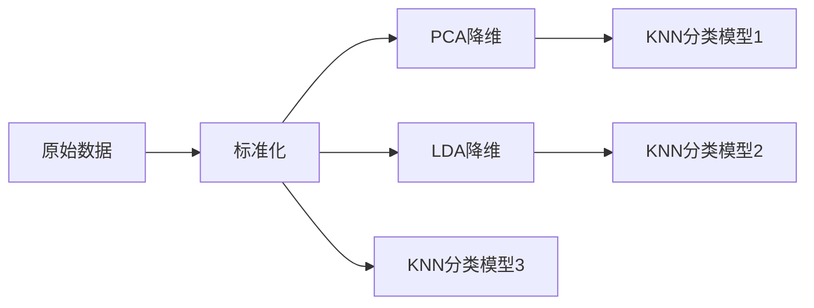

# 数据归约技术实验报告：基于 Wine Quality 数据集的 PCA 与 LDA 分析

**GitHub 仓库**：[(https://github.com/djj316/zyh.)]  
**最后更新**：2025年4月13日  

---

## 目录
1. [实验目的](#1-实验目的)  
2. [数据集](#2-数据集)  
3. [方法](#3-方法)  
4. [结果](#4-结果)  
5. [讨论](#5-讨论)  
6. [结论](#6-结论)  
7. [附录](#7-附录)  

---

## 1. 实验目的
比较 PCA（主成分分析）和 LDA（线性判别分析）在葡萄酒质量分类任务中的表现：
- 评估不同降维技术对分类准确率的影响  
- 可视化高维数据在低维空间的投影结构  
- 分析方差保留与维度缩减的权衡关系  

---

## 2. 数据集
### 数据来源
UCI Machine Learning Repository : [Wine Quality Dataset (ID:186)](https://archive.ics.uci.edu/ml/datasets/Wine+Quality)

### 特征说明
| 特征类型       | 数量 | 示例                  |
|----------------|------|-----------------------|
| 理化指标       | 11   | 酸度、pH值、酒精浓度等 |
| 目标变量       | 1    | 质量评分（3-9）       |

### 预处理
```python
# 质量评分分箱（3类）
y = np.digitize(y, bins=[3, 6], right=True) - 1
# 数据划分（70%训练集，30%测试集）
X_train, X_test, y_train, y_test = train_test_split(X, y, test_size=0.3, random_state=42)
```

---

## 3. 方法
### 技术流程


### 关键代码
#### 选择最合适的PCA维度
```python
pca_full = PCA()
pca_full.fit(X_train_scaled)
n_components_95 = np.argmax(np.cumsum(pca_full.explained_variance_ratio_) >= 0.95) + 1
```

#### LDA 投影
```python
lda = LinearDiscriminantAnalysis(n_components=2)
X_train_lda = lda.fit_transform(X_train, y_train)
```
---

## 4. 结果
### 4.1 分类准确率对比
| 方法       | 测试准确率 | 降维后维度 |
|------------|------------|------------|
| 原始特征    | 0.80       | 11         |
| PCA        | 0.84       | 9          |
| LDA        | 0.82       | 2          |

### 4.2 可视化
#### PCA 累计方差解释率
  
*保留95%方差需要9个主成分*

#### LDA vs PCA 二维投影
  

#### 模型分类准确率比对
 

---

## 5. 讨论
### PCA 表现
- 前两个主成分仅解释50%方差  
- **优点**：无监督方法，适合特征探索  
- **缺点**：低维投影丢失部分分类信息  

### LDA 表现
- 强制降维至2维仍保持较高分类性能  
- **优点**：监督学习，直接优化类别分离  
- **缺点**：最多降至`C-1`维（C为类别数）  

---

## 6. 结论
1. PCA 在保留95%方差时可减少18%维度(11→9) 
2. LDA 在极端降维(11→2)场景下效率更高  
3. **推荐方案**：  
   - 优先使用PCA进行初步特征分析  
   - 若需强降维且标签可靠，选择LDA  
---

## 7. 附录
### 环境配置
```bash
Python 3.8+  
库依赖：  
- numpy>=1.21  
- scikit-learn>=1.0  
- matplotlib>=3.5  
```

### 运行说明
1. 克隆仓库：
   ```bash
   git clone [您的仓库URL]
   ```
2. 安装依赖：
   ```bash
   pip install -r requirements.txt
   ```
3. 执行实验：
   ```bash
   python scripts/wine_analysis.py
   ```

---

**报告作者**：zyh 
**License**：MIT

