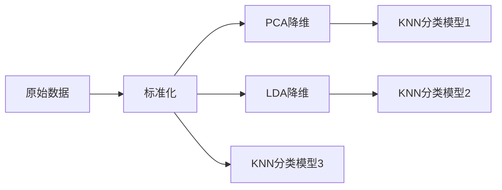
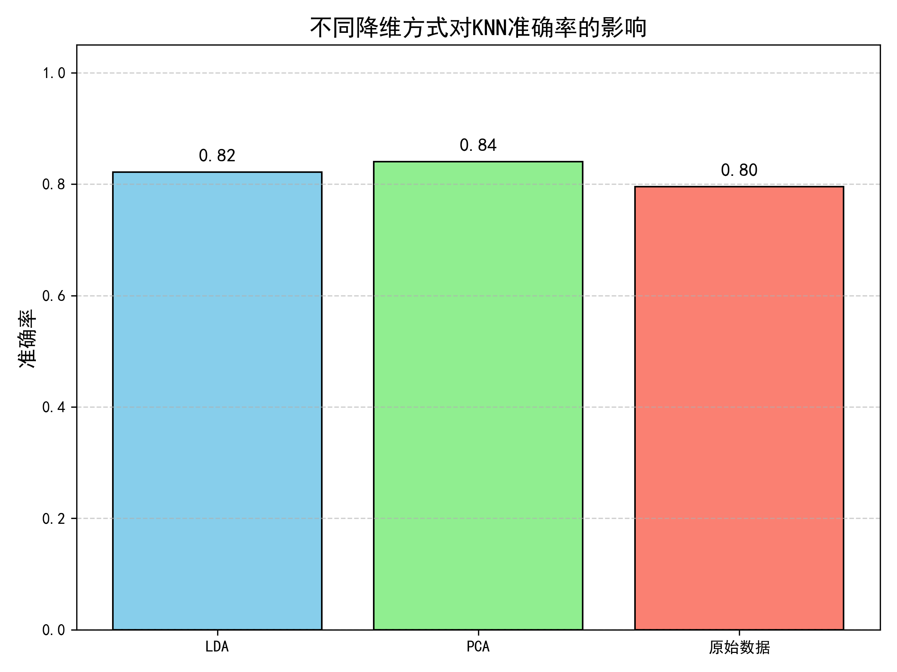

# 数据归约技术实验报告：基于 Wine Quality 数据集的 PCA 与 LDA 分析

**GitHub 仓库**：[(https://github.com/djj316/zyh.)]  
**最后更新**：2025年4月13日  

---

## 目录
1. [实验目的](#1-实验目的)  
2. [数据集](#2-数据集)  
3. [方法](#3-方法)  
4. [结果](#4-结果)  
5. [讨论](#5-讨论)  
6. [结论](#6-结论)  
7. [附录](#7-附录)  

---

## 1. 实验目的
比较 PCA（主成分分析）和 LDA（线性判别分析）在葡萄酒质量分类任务中的表现：
- 评估不同降维技术对分类准确率的影响  
- 可视化高维数据在低维空间的投影结构  
- 分析方差保留与维度缩减的权衡关系  

---

## 2. 数据集
### 数据来源
UCI Machine Learning Repository : [Wine Quality Dataset (ID:186)](https://archive.ics.uci.edu/ml/datasets/Wine+Quality)

### 特征说明
| 特征类型       | 数量 | 示例                  |
|----------------|------|-----------------------|
| 理化指标       | 11   | 酸度、pH值、酒精浓度等 |
| 目标变量       | 1    | 质量评分（3-9）       |

### 预处理
```python
# 质量评分分箱（3类）
y = np.digitize(y, bins=[3, 6], right=True) - 1
# 数据划分（70%训练集，30%测试集）
X_train, X_test, y_train, y_test = train_test_split(X, y, test_size=0.3, random_state=42)
```
---

## 3. 方法
### 技术流程


### 关键代码
#### 选择最合适的PCA维度
```python
pca_full = PCA()
pca_full.fit(X_train_scaled)
n_components_95 = np.argmax(np.cumsum(pca_full.explained_variance_ratio_) >= 0.95) + 1
```

#### LDA 投影
```python
lda = LinearDiscriminantAnalysis(n_components=2)
X_train_lda = lda.fit_transform(X_train, y_train)
```
---

## 4. 结果
### 4.1 分类准确率对比
| 方法       | 测试准确率 | 降维后维度 |
|------------|------------|------------|
| 原始特征    | 0.80       | 11         |
| PCA        | 0.84       | 9          |
| LDA        | 0.82       | 2          |

### 4.2 可视化
#### PCA 累计方差解释率
*保留95%方差需要9个主成分* 
 

#### LDA vs PCA 二维投影
  

#### 模型分类准确率比对
 

---

## 5. 讨论
### PCA 表现
- 前两个主成分仅解释50%方差  
- **优点**：无监督方法，适合特征探索  
- **缺点**：低维投影丢失部分分类信息  

### LDA 表现
- 强制降维至2维仍保持较高分类性能  
- **优点**：监督学习，直接优化类别分离  
- **缺点**：最多降至`C-1`维（C为类别数）  

---

## 6. 结论
1. PCA 在保留95%方差时可减少18%维度(11→9) 
2. LDA 在极端降维(11→2)场景下效率更高  
3. **推荐方案**：  
   - 优先使用PCA进行初步特征分析  
   - 若需强降维且标签可靠，选择LDA  
---

## 7. 附录
### 环境配置
```bash
Python 3.8+  
库依赖：  
- numpy>=1.21  
- scikit-learn>=1.0  
- matplotlib>=3.5  
```

### 运行说明
1. 克隆仓库：
   ```bash
   git clone [https://github.com/djj316/zyh.git]
   ```
2. 安装依赖：
   ```bash
   pip install -r requirements.txt
   ```
3. 执行实验：
   ```bash
   python scripts/wine_analysis.py
   ```
4. 完整代码
   ```python
   from ucimlrepo import fetch_ucirepo
   import numpy as np
   import pandas as pd
   import matplotlib.pyplot as plt
   from sklearn.model_selection import train_test_split
   from sklearn.preprocessing import StandardScaler
   from sklearn.decomposition import PCA
   from sklearn.discriminant_analysis import LinearDiscriminantAnalysis
   from sklearn.neighbors import KNeighborsClassifier
   from sklearn.metrics import accuracy_score
   from matplotlib.colors import Normalize
   import matplotlib

   # 中文设置
   norm = Normalize(vmin=0, vmax=2)
   matplotlib.rcParams['font.sans-serif'] = ['SimHei']
   matplotlib.rcParams['axes.unicode_minus'] = False

   # 1. 获取 Wine Quality 数据集
   wine_quality = fetch_ucirepo(id=186)
   X = np.array(wine_quality.data.features)
   y = np.array(wine_quality.data.targets).flatten()

   # 2. 将质量评分转换为三类标签
   y = np.where(y < 4, 0, np.where(y < 7, 1, 2))

   # 3. 划分训练集与测试集
   X_train, X_test, y_train, y_test = train_test_split(X, y, test_size=0.3, random_state=42)

   # 4. 标准化用于 PCA
   scaler = StandardScaler()
   X_train_scaled = scaler.fit_transform(X_train)
   X_test_scaled = scaler.transform(X_test)

   # 5. 寻找保留95%方差的PCA维度数
   pca_full = PCA()
   pca_full.fit(X_train_scaled)
   cumulative_variance = np.cumsum(pca_full.explained_variance_ratio_)
   n_components_95 = np.argmax(cumulative_variance >= 0.95) + 1
   print(f"保留 95% 方差所需 PCA 维度数: {n_components_95}")

   # 6. 使用 PCA 降维
   pca = PCA(n_components=n_components_95)
   X_train_pca = pca.fit_transform(X_train_scaled)
   X_test_pca = pca.transform(X_test_scaled)

   # 7. 使用 LDA 降维
   lda = LinearDiscriminantAnalysis(n_components=2)
   X_train_lda = lda.fit_transform(X_train, y_train)
   X_test_lda = lda.transform(X_test)

   # 8. 使用 KNN 进行训练与预测
   knn_lda = KNeighborsClassifier(n_neighbors=3).fit(X_train_lda, y_train)
   knn_pca = KNeighborsClassifier(n_neighbors=3).fit(X_train_pca, y_train)
   knn_raw = KNeighborsClassifier(n_neighbors=3).fit(X_train, y_train)

   # 9. 评估准确率
   accuracy_lda = accuracy_score(y_test, knn_lda.predict(X_test_lda))
   accuracy_pca = accuracy_score(y_test, knn_pca.predict(X_test_pca))
   accuracy_raw = accuracy_score(y_test, knn_raw.predict(X_test))

   print(f"Accuracy with LDA: {accuracy_lda:.2f}")
   print(f"Accuracy with PCA (自动维度={n_components_95}): {accuracy_pca:.2f}")
   print(f"Accuracy without LDA or PCA: {accuracy_raw:.2f}")

   # 10. 可视化 LDA 和 PCA 降维结果
   plt.figure(figsize=(14, 6))

   # LDA 可视化
   plt.subplot(1, 2, 1)
   scatter_lda = plt.scatter(X_test_lda[:, 0], X_test_lda[:, 1],
                           c=y_test, cmap='viridis', edgecolor='k', s=80)
   plt.title("LDA: 2D Projection")
   plt.xlabel("LDA Component 1")
   plt.ylabel("LDA Component 2")
   cbar_lda = plt.colorbar(scatter_lda, ticks=[0, 1, 2])
   cbar_lda.ax.set_yticklabels(['低质量', '中质量', '高质量'])

   # PCA 可视化
   plt.subplot(1, 2, 2)
   scatter_pca = plt.scatter(X_test_pca[:, 0], X_test_pca[:, 1],
                           c=y_test, cmap='viridis', edgecolor='k', s=80)
   plt.title("PCA: First 2 Components")
   plt.xlabel("PCA Component 1")
   plt.ylabel("PCA Component 2")
   cbar_pca = plt.colorbar(scatter_pca, ticks=[0, 1, 2])
   cbar_pca.ax.set_yticklabels(['低质量', '中质量', '高质量'])

   plt.tight_layout()
   plt.savefig("LDA与PCA投影可视化.png", dpi=300)
   plt.show()

   # 11. PCA 累计解释方差图
   plt.figure(figsize=(8, 5))
   plt.plot(range(1, len(cumulative_variance) + 1), cumulative_variance, marker='o')
   plt.axhline(y=0.95, color='r', linestyle='--', label='95% 方差')
   plt.xlabel("PCA 维度数")
   plt.ylabel("累计解释方差比")
   plt.title("PCA 累计解释方差图")
   plt.grid(True)
   plt.legend()
   plt.savefig("PCA累计解释方差图.png", dpi=300)
   plt.show()

   # 12. 模型准确率对比柱状图
   plt.figure(figsize=(8, 6))
   models = ['LDA', 'PCA', '原始数据']
   accuracies = [accuracy_lda, accuracy_pca, accuracy_raw]
   colors = ['skyblue', 'lightgreen', 'salmon']

   bars = plt.bar(models, accuracies, color=colors, edgecolor='black')

   # 添加准确率文本
   for bar in bars:
      yval = bar.get_height()
      plt.text(bar.get_x() + bar.get_width() / 2, yval + 0.015,
               f'{yval:.2f}', ha='center', va='bottom', fontsize=12)

   plt.ylim(0, 1.05)
   plt.title('不同降维方式对KNN准确率的影响', fontsize=15)
   plt.ylabel('准确率', fontsize=13)
   plt.grid(axis='y', linestyle='--', alpha=0.6)
   plt.tight_layout()
   plt.savefig("模型准确率对比.png", dpi=300)
   plt.show()
   ```
---

**报告作者**:zyh 

