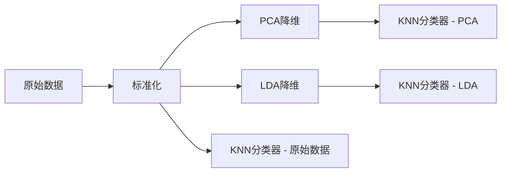
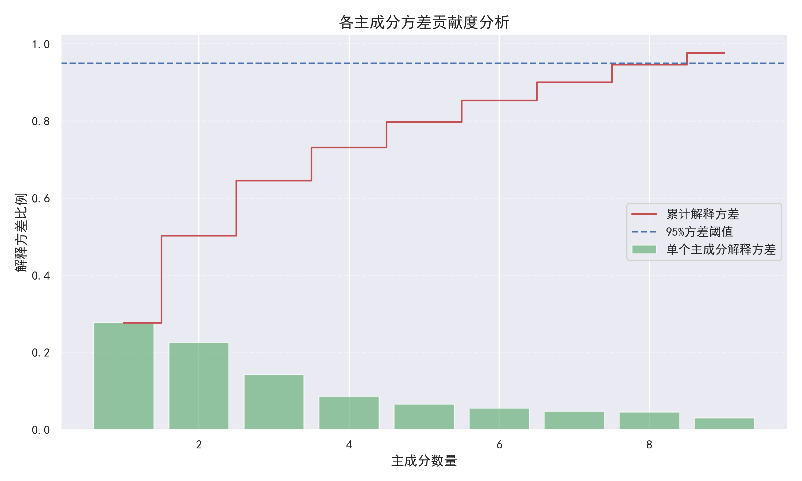

# 数据归约技术实验报告：基于 Wine Quality 数据集的 PCA 与 LDA 分析

**GitHub 仓库**：[https://github.com/djj316/Data-Reduction](https://github.com/djj316/Data-Reduction)  
**最后更新**：2025年4月13日  

---

## 目录
1. [实验目的](#1-实验目的)  
2. [数据集](#2-数据集)  
3. [方法](#3-方法)  
4. [实验结果](#4-实验结果)  
5. [结果分析与讨论](#5-结果分析与讨论)  
6. [结论](#6-结论)  
7. [附录](#7-附录)  

---

## 1. 实验目的
本实验旨在探讨两种经典降维技术——主成分分析（Principal Component Analysis, PCA）与线性判别分析（Linear Discriminant Analysis, LDA）在葡萄酒质量分类任务中的应用效果，具体目标如下：

- 比较不同降维方法对分类模型性能的影响；
- 可视化高维数据在低维空间中的分布特征；
- 分析方差保留率与维度压缩之间的权衡关系；
- 评估数据规约对后续学习任务的作用与影响。

---

## 2. 数据集

### 数据来源
实验所使用的数据集来源于 UCI 机器学习仓库：  
👉 [Wine Quality Dataset (ID:186)](https://archive.ics.uci.edu/ml/datasets/Wine+Quality)

### 特征描述

| 特征类别 | 数量 | 示例特征                 |
|----------|------|--------------------------|
| 理化指标 | 11   | 酸度、pH值、酒精浓度等   |
| 目标变量 | 1    | 质量评分（范围 3~9）     |

### 数据预处理
为简化分类任务，将原始的葡萄酒质量评分离散化为三个等级（低、中、高）：

```python
# 将评分按阈值进行分箱，得到三类标签
y = np.digitize(y, bins=[3, 6], right=True) - 1
```

此外，数据集按照 7:3 的比例划分为训练集和测试集，并对特征进行了标准化处理以适应 PCA 处理要求。

---

## 3. 方法

### 技术流程概述



本实验采用 KNN（K-近邻）作为统一的分类器，对原始特征、PCA 降维后特征以及 LDA 降维后特征分别进行分类评估。PCA 为无监督降维方法，主要基于数据方差；而 LDA 属于监督式方法，目标是最大化类间距离与最小化类内距离。

---

## 4. 实验结果

### 4.1 分类准确率比较

| 方法         | 测试准确率 | 降维后维度 |
|--------------|------------|------------|
| 原始特征集   | 0.80       | 11         |
| PCA 降维      | 0.84       | 9          |
| LDA 降维      | 0.82       | 2          |

### 4.2 可视化结果

#### PCA 累计方差解释率  


#### 主成分方差贡献度分析  


#### LDA 与 PCA 二维投影对比  


#### 分类准确率对比图  


---

## 5. 结果分析与讨论

### PCA 方法分析
- 前两个主成分共解释约 50% 的方差，说明数据在前两个维度上仍存在大量信息损失；
- 在保留 95% 方差的前提下，可将维度从 11 降至 9，降维效果显著；
- 由于 PCA 为无监督方法，其低维投影可能未能有效突出类别间差异，因此在分类任务中表现略逊于 LDA；
- 适合用于探索性数据分析与可视化。

### LDA 方法分析
- 尽管被约束至二维空间，LDA 仍能维持较高的分类准确率，展示出良好的类别判别能力；
- LDA 通过监督学习显式最大化类间距离，提升了低维空间的可分性；
- 理论上，LDA 的投影维度不超过类别数减一（C-1），本实验中为 2 维，限制了降维灵活性；
- 更适用于有监督的降维与可视化场景。

---

## 6. 结论

结合实验结果，得出以下结论：

1. 在保留 95% 总方差的前提下，PCA 可有效将原始特征维度从 11 降至 9，维度压缩率为 18.2%；
2. LDA 虽仅保留两个维度，但其监督性质使得在分类准确率上优于原始特征，且与 PCA 表现接近；
3. **实用建议**：
   - 进行特征探索或可视化时，推荐优先使用 PCA；
   - 若目标为提升分类性能，且具有可靠标签信息，则建议使用 LDA；
   - 在建模过程中可结合两者进行综合评估与选择。

---

## 7. 附录

### 实验环境

```bash
Python 版本：3.8+  
依赖库：  
- numpy >= 1.21  
- scikit-learn >= 1.0  
- matplotlib >= 3.5  
```

### 完整源代码
详见本文末尾代码块，或访问 GitHub 仓库获取：[Data-Reduction](https://github.com/djj316/Data-Reduction)

<details>
<summary>📄 点击展开完整源代码</summary>

```python
from ucimlrepo import fetch_ucirepo
import numpy as np
import pandas as pd
import matplotlib.pyplot as plt
import seaborn as sns
from sklearn.model_selection import train_test_split
from sklearn.preprocessing import StandardScaler
from sklearn.decomposition import PCA
from sklearn.discriminant_analysis import LinearDiscriminantAnalysis
from sklearn.neighbors import KNeighborsClassifier
from sklearn.metrics import accuracy_score
from matplotlib.colors import Normalize
import matplotlib

# 中文设置
norm = Normalize(vmin=0, vmax=2)
matplotlib.rcParams['font.sans-serif'] = ['SimHei']
matplotlib.rcParams['axes.unicode_minus'] = False

# 1. 获取 Wine Quality 数据集
wine_quality = fetch_ucirepo(id=186)
X = np.array(wine_quality.data.features)
y = np.array(wine_quality.data.targets).flatten()

# 2. 将质量评分转换为三类标签
y = np.where(y < 4, 0, np.where(y < 7, 1, 2))

# 3. 划分训练集与测试集
X_train, X_test, y_train, y_test = train_test_split(X, y, test_size=0.3, random_state=42)

# 4. 标准化用于 PCA
scaler = StandardScaler()
X_train_scaled = scaler.fit_transform(X_train)
X_test_scaled = scaler.transform(X_test)

# 5. 寻找保留95%方差的PCA维度数
pca_full = PCA()
pca_full.fit(X_train_scaled)
cumulative_variance = np.cumsum(pca_full.explained_variance_ratio_)
n_components_95 = np.argmax(cumulative_variance >= 0.95) + 1
print(f"保留 95% 方差所需 PCA 维度数: {n_components_95}")

# 6. 使用 PCA 降维
pca = PCA(n_components=n_components_95)
X_train_pca = pca.fit_transform(X_train_scaled)
X_test_pca = pca.transform(X_test_scaled)

# 7. 使用 LDA 降维
lda = LinearDiscriminantAnalysis(n_components=2)
X_train_lda = lda.fit_transform(X_train, y_train)
X_test_lda = lda.transform(X_test)

# 8. 使用 KNN 进行训练与预测
knn_lda = KNeighborsClassifier(n_neighbors=3).fit(X_train_lda, y_train)
knn_pca = KNeighborsClassifier(n_neighbors=3).fit(X_train_pca, y_train)
knn_raw = KNeighborsClassifier(n_neighbors=3).fit(X_train, y_train)

# 9. 评估准确率
accuracy_lda = accuracy_score(y_test, knn_lda.predict(X_test_lda))
accuracy_pca = accuracy_score(y_test, knn_pca.predict(X_test_pca))
accuracy_raw = accuracy_score(y_test, knn_raw.predict(X_test))

print(f"Accuracy with LDA: {accuracy_lda:.2f}")
print(f"Accuracy with PCA (自动维度={n_components_95}): {accuracy_pca:.2f}")
print(f"Accuracy without LDA or PCA: {accuracy_raw:.2f}")

# 10. 可视化 LDA 和 PCA 降维结果
plt.figure(figsize=(14, 6))

# LDA 可视化
plt.subplot(1, 2, 1)
scatter_lda = plt.scatter(X_test_lda[:, 0], X_test_lda[:, 1],
                        c=y_test, cmap='viridis', edgecolor='k', s=80)
plt.title("LDA: 2D Projection")
plt.xlabel("LDA Component 1")
plt.ylabel("LDA Component 2")
cbar_lda = plt.colorbar(scatter_lda, ticks=[0, 1, 2])
cbar_lda.ax.set_yticklabels(['低质量', '中质量', '高质量'])

# PCA 可视化
plt.subplot(1, 2, 2)
scatter_pca = plt.scatter(X_test_pca[:, 0], X_test_pca[:, 1],
                        c=y_test, cmap='viridis', edgecolor='k', s=80)
plt.title("PCA: First 2 Components")
plt.xlabel("PCA Component 1")
plt.ylabel("PCA Component 2")
cbar_pca = plt.colorbar(scatter_pca, ticks=[0, 1, 2])
cbar_pca.ax.set_yticklabels(['低质量', '中质量', '高质量'])

plt.tight_layout()
plt.savefig("LDA与PCA投影可视化.png", dpi=300)
plt.show()

# 11. PCA 累计解释方差图
plt.figure(figsize=(8, 5))
plt.plot(range(1, len(cumulative_variance) + 1), cumulative_variance, marker='o')
plt.axhline(y=0.95, color='r', linestyle='--', label='95% 方差')
plt.xlabel("PCA 维度数")
plt.ylabel("累计解释方差比")
plt.title("PCA 累计解释方差图")
plt.grid(True)
plt.legend()
plt.savefig("PCA累计解释方差图.png", dpi=300)
plt.show()

# 12. 模型准确率对比柱状图
plt.figure(figsize=(8, 6))
models = ['LDA', 'PCA', '原始数据']
accuracies = [accuracy_lda, accuracy_pca, accuracy_raw]
colors = ['skyblue', 'lightgreen', 'salmon']

bars = plt.bar(models, accuracies, color=colors, edgecolor='black')

for bar in bars:
   yval = bar.get_height()
   plt.text(bar.get_x() + bar.get_width() / 2, yval + 0.015,
            f'{yval:.2f}', ha='center', va='bottom', fontsize=12)

plt.ylim(0, 1.05)
plt.title('不同降维方式对KNN准确率的影响', fontsize=15)
plt.ylabel('准确率', fontsize=13)
plt.grid(axis='y', linestyle='--', alpha=0.6)
plt.tight_layout()
plt.savefig("模型准确率对比.png", dpi=300)
plt.show()

# 14. 主成分方差贡献度分析
plt.figure(figsize=(10, 6))
explained_variance = pca.explained_variance_ratio_
cumulative = np.cumsum(explained_variance)

plt.bar(range(1, len(explained_variance)+1), 
      explained_variance, 
      alpha=0.6,
      color='g',
      label='单个主成分解释方差')

plt.step(range(1, len(cumulative)+1), 
         cumulative, 
         where='mid',
         label='累计解释方差',
         color='r')

plt.axhline(y=0.95, color='b', linestyle='--', label='95%方差阈值')
plt.xlabel("主成分数量")
plt.ylabel("解释方差比例")
plt.title("各主成分方差贡献度分析", fontsize=14)
plt.legend(loc='best')
plt.grid(axis='y', linestyle='--', alpha=0.4)
plt.tight_layout()
plt.savefig("主成分方差贡献度.png", dpi=300)
plt.show()
```

</details>

---

**报告作者**：  
```
zyh
```

